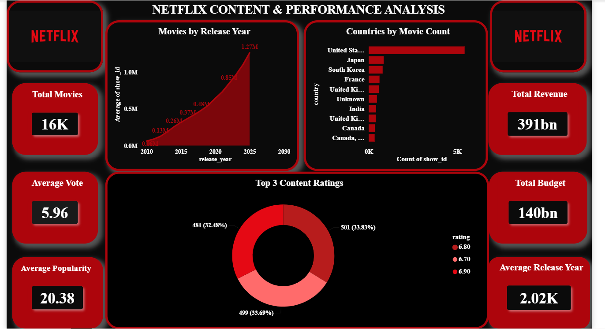

<div align="center">

# 🎬 Netflix Content Performance Analysis

### *End-to-End Data Analytics Project | Cleaning → Database → SQL → Power BI*

[](https://www.python.org/)
[](https://pandas.pydata.org/)
[](https://numpy.org/)
[](https://matplotlib.org/)
[](https://www.mysql.com/)
[](#-sql-analysis)
[](https://powerbi.microsoft.com/)
[](https://jupyter.org/)
[](https://git-scm.com/)
[](https://github.com/AmeySawatkar)
[](#-license)
[](#)

*A complete data analytics workflow transforming raw Netflix content data into actionable business intelligence.*

</div>

---

## 📌 Project Overview

**Netflix Content Performance Analysis** is a comprehensive, end-to-end Data Analytics project developed during my internship at **SkillinfyTech IT Solutions Pvt. Ltd.** The project simulates a real-world analytics pipeline — starting from raw, messy content data and progressing through systematic cleaning, relational database design, advanced SQL analysis, and an interactive Power BI dashboard.

The dataset, **"Netflix Movies Detailed up to 2025"**, contains **16,000 records** describing Netflix's content catalog, including release patterns, ratings, countries of origin, popularity metrics, budgets, and revenue figures. Using **Python** for preprocessing, **MySQL** for structured storage, **SQL** for business-driven querying, and **Power BI** for visual storytelling, this project uncovers actionable insights into content trends, regional performance, audience reception, and financial outcomes across Netflix's catalog.

> This project reflects a production-style analytics workflow — the same approach used by data teams to convert raw data into strategic business decisions.

---

## 🎯 Project Objectives

- Clean and standardize a large-scale, real-world Netflix content dataset for analysis-ready use.
- Design and implement a normalized MySQL database to store and manage the cleaned data.
- Write 50+ business-focused SQL queries to extract deep, actionable insights.
- Build an interactive, executive-ready Power BI dashboard for visual analytics.
- Identify content trends across release years, countries, ratings, and popularity.
- Analyze revenue and budget patterns to understand financial performance.
- Translate raw data into strategic, decision-ready business insights.
- Demonstrate a complete, professional analytics pipeline from raw data to dashboard.

---

## ✨ Project Features

| | Feature |
|---|---|
| ✔ | Data Cleaning |
| ✔ | Missing Value Handling |
| ✔ | Duplicate Removal |
| ✔ | MySQL Database Design |
| ✔ | SQL Analysis |
| ✔ | 50 Business SQL Queries |
| ✔ | Interactive Power BI Dashboard |
| ✔ | Business Insights |
| ✔ | Data Visualization |
| ✔ | End-to-End Analytics Workflow |

---

## 📊 Dataset Information

| Attribute | Details |
|---|---|
| **Dataset Name** | Netflix Movies Detailed up to 2025 |
| **Total Records** | 16,000 |
| **Final Cleaned Columns** | 17 |
| **Format** | CSV |
| **Source Type** | Netflix Content Catalog Data |
| **Cleaning Tool** | Python (Pandas, NumPy) |
| **Storage** | MySQL Relational Database |

---

## 🛠️ Technology Stack

| Category | Technology | Purpose |
|---|---|---|
| 🐍 Programming Language | Python | Data cleaning & preprocessing |
| 🧮 Data Manipulation | Pandas, NumPy | Handling & transforming datasets |
| 📈 Visualization (EDA) | Matplotlib | Exploratory data visualization |
| 🗄️ Database | MySQL | Structured data storage |
| 🔍 Query Language | SQL | Business analysis queries |
| 📊 BI Tool | Microsoft Power BI | Interactive dashboard & reporting |
| 📓 Development Environment | Jupyter Notebook | Data cleaning & analysis workspace |
| 🔧 Version Control | Git & GitHub | Source control & project hosting |

---

## 🔄 Project Workflow

```
Raw Dataset
     ↓
Python Data Cleaning
     ↓
Data Preprocessing
     ↓
MySQL Database
     ↓
SQL Analysis
     ↓
Power BI Dashboard
     ↓
Business Insights
```

---

## 🧹 Python Data Cleaning

The raw dataset required significant preprocessing before it could be used for reliable analysis. Using **Python (Pandas & NumPy)** in a Jupyter Notebook environment, the following steps were performed:

<details>
<summary><strong>Click to expand cleaning process details</strong></summary>

- **Missing Value Treatment** — Identified null and inconsistent entries across critical fields and handled them using appropriate imputation or removal strategies based on column context.
- **Duplicate Removal** — Detected and eliminated duplicate records to ensure data integrity and accurate aggregation results.
- **Data Type Standardization** — Converted columns (dates, numeric fields, categorical fields) into their correct data types for consistent downstream processing.
- **Text Normalization** — Standardized inconsistent text formatting (casing, whitespace, special characters) across categorical columns such as country and rating.
- **Column Pruning & Restructuring** — Reduced the dataset to **17 clean, analysis-ready columns**, removing redundant or irrelevant fields.
- **Outlier Review** — Reviewed budget and revenue fields for anomalies that could distort financial analysis.
- **Export** — Saved the final cleaned dataset as `netflix_content_cleaned.csv`, ready for database ingestion.

</details>

---

## 🗄️ MySQL Database

The cleaned dataset was imported into a structured **MySQL** relational database to enable robust, scalable querying.

- **Database Name:** `netflix_content_analysis`
- **Table Name:** `netflix_content`
- **Records Imported:** ✅ 16,000 records imported successfully
- **Schema Design:** Column data types were mapped precisely to the cleaned dataset structure to preserve accuracy for numeric, date, and categorical fields.

```sql
USE netflix_content_analysis;

SELECT COUNT(*) AS total_records
FROM netflix_content;
-- Output: 16000
```

---

## 🔍 SQL Analysis

A total of **50 business-focused SQL queries** were written against the `netflix_content` table to extract meaningful insights across multiple analytical dimensions.

**Query techniques used:**

- 📌 Aggregate Functions (`COUNT`, `SUM`, `AVG`, `MIN`, `MAX`)
- 📌 `GROUP BY` for categorical breakdowns
- 📌 `ORDER BY` for ranking and trend analysis
- 📌 `HAVING` for filtered aggregations
- 📌 `JOINS` (where applicable)
- 📌 Subqueries for nested and comparative analysis
- 📌 Business Intelligence Queries covering revenue, popularity, ratings, and regional performance

> 📁 Full query set available in [`NETFLIX_CONTENT_PERFORMANCE_ANALYSIS_SQL_Queries.sql`](./NETFLIX_CONTENT_PERFORMANCE_ANALYSIS_SQL_Queries.sql)

<details>
<summary><strong>Sample Query Preview</strong></summary>

```sql
-- Top 10 countries by content volume
SELECT country,
       COUNT(*) AS total_titles
FROM netflix_content
GROUP BY country
ORDER BY total_titles DESC
LIMIT 10;
```

</details>

---

## 📊 Power BI Dashboard

An interactive, executive-style **Power BI dashboard** was built to visually communicate the key findings from the SQL analysis in a business-friendly format.

**Dashboard Components:**

- 🎯 KPI Cards (Total Titles, Total Revenue, Avg. Budget, Avg. Popularity)
- 📅 Release Year Analysis
- 🌍 Country-wise Content Analysis
- ⭐ Top 3 Content Ratings
- 🔥 Popularity Analysis
- 💰 Revenue Analysis
- 📉 Budget Analysis
- 💡 Business Insights Panel

### Dashboard Preview

## 📊 Dashboard Preview

---

<p align="center">
  
</p>

---

---

## 💡 Key Business Insights

1. Content production shows a distinct upward trend in recent release years, reflecting Netflix's aggressive content expansion strategy.
2. A small number of countries account for a disproportionately large share of total content output.
3. Certain content ratings dominate the catalog, indicating a clear targeting of specific audience segments.
4. Popularity scores vary significantly across content categories, highlighting inconsistent audience engagement.
5. Revenue performance is concentrated among a limited subset of high-performing titles.
6. Budget allocation does not always correlate directly with revenue or popularity outcomes.
7. Regional content strategies differ notably, suggesting localized content investment decisions.
8. The top-performing content ratings consistently outperform others across both popularity and revenue metrics.
9. Older content years show comparatively fewer titles, reflecting the platform's historical content acquisition pace.
10. High-budget titles do not guarantee proportionally higher popularity, indicating diminishing returns on production spend.

---

## 📂 Repository Structure

```
NETFLIX_CONTENT_PERFORMANCE_ANALYSIS
│── NETFLIX_CONTENT_ANALYSIS.ipynb
│── netflix_content_cleaned.csv
│── netflix_movies_detailed_up_to_2025.csv
│── NETFLIX_CONTENT_PERFORMANCE_ANALYSIS_SQL_Queries.sql
│── NETFLIX_CONTENT_PERFORMANCE_ANALYSIS.pbix
│── Netflix_Content_Performance_Analysis_Report.pdf
│── Netflix-Content-Performance-Analysis.pptx
│── Netflix_Content_Analysis_Dashboard.png
│── README.md
```

---

## ⚙️ Installation Guide

Follow these steps to set up the project locally:

```bash
# 1. Clone the repository
git clone https://github.com/AmeySawatkar/NETFLIX_CONTENT_PERFORMANCE_ANALYSIS.git

# 2. Navigate into the project directory
cd NETFLIX_CONTENT_PERFORMANCE_ANALYSIS

# 3. Install required Python dependencies
pip install pandas numpy matplotlib jupyter mysql-connector-python

# 4. Launch Jupyter Notebook
jupyter notebook
```

---

## ▶️ How to Run

<details>
<summary><strong>1️⃣ Python Notebook</strong></summary>

- Open `NETFLIX_CONTENT_ANALYSIS.ipynb` in Jupyter Notebook.
- Run all cells sequentially to reproduce the data cleaning and preprocessing pipeline.
- The cleaned output will be exported as `netflix_content_cleaned.csv`.

</details>

<details>
<summary><strong>2️⃣ MySQL</strong></summary>

- Create the database:
  ```sql
  CREATE DATABASE netflix_content_analysis;
  ```
- Import `netflix_content_cleaned.csv` into the `netflix_content` table using MySQL Workbench's Table Data Import Wizard or the `LOAD DATA INFILE` command.
- Execute the scripts in `NETFLIX_CONTENT_PERFORMANCE_ANALYSIS_SQL_Queries.sql` to run the full set of 50 business queries.

</details>

<details>
<summary><strong>3️⃣ Power BI</strong></summary>

- Open `NETFLIX_CONTENT_PERFORMANCE_ANALYSIS.pbix` in Power BI Desktop.
- Refresh the data source connection to point to your local MySQL database (or the cleaned CSV).
- Explore the interactive dashboard pages and filters.

</details>

---

## 🎓 Learning Outcomes

- Gained hands-on experience in real-world data cleaning and preprocessing using Python.
- Strengthened database design and management skills using MySQL.
- Developed advanced SQL querying proficiency, including aggregations, subqueries, and business logic translation.
- Built practical skills in designing interactive, business-ready dashboards in Power BI.
- Learned to translate raw data into structured, decision-oriented business insights.
- Understood the complete end-to-end analytics lifecycle used in professional data teams.

---

## 🚀 Future Enhancements

- Integrate machine learning models to predict content popularity and revenue potential.
- Automate the ETL pipeline using Python scripts or workflow orchestration tools.
- Expand the dataset with real-time content performance updates via API integration.
- Add sentiment analysis on audience reviews for deeper engagement insights.
- Deploy the Power BI dashboard to Power BI Service for live, shareable access.
- Incorporate advanced statistical modeling for deeper financial forecasting.

---

## 🏢 About the Internship

This project was completed as part of a **Data Analytics Internship** at **SkillinfyTech IT Solutions Pvt. Ltd.**, focused on applying real-world data analytics techniques across the full pipeline — from raw data cleaning to business-ready dashboard reporting.

---

## 👤 Author

**Amey Kishor Sawatkar**

[](https://github.com/AmeySawatkar)
[](#)

https://www.linkedin.com/in/amey-sawatkar-123237338/

---

## ⭐ Support

If you found this project useful or insightful, please consider giving it a **⭐ star** on GitHub — it helps others discover this work and supports continued development!

---

## 📄 License

This project is licensed under the **MIT License** — see below for details.

```
MIT License

Copyright (c) 2026 Amey Kishor Sawatkar

Permission is hereby granted, free of charge, to any person obtaining a copy
of this software and associated documentation files (the "Software"), to deal
in the Software without restriction, including without limitation the rights
to use, copy, modify, merge, publish, distribute, sublicense, and/or sell
copies of the Software, subject to the following conditions:

The above copyright notice and this permission notice shall be included in
all copies or substantial portions of the Software.

THE SOFTWARE IS PROVIDED "AS IS", WITHOUT WARRANTY OF ANY KIND, EXPRESS OR
IMPLIED, INCLUDING BUT NOT LIMITED TO THE WARRANTIES OF MERCHANTABILITY,
FITNESS FOR A PARTICULAR PURPOSE AND NONINFRINGEMENT.
```

---

<div align="center">

**Made with 📊 and ☕ by [Amey Kishor Sawatkar](https://github.com/AmeySawatkar)**

</div>
